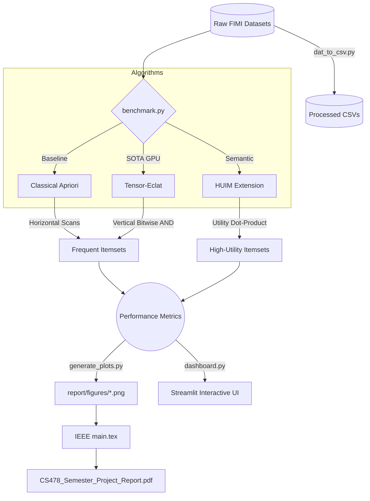

# 🚀 CS-478: Frequent Itemset Mining (FIM) Optimization & GPU Acceleration


**Course:** CS-478 Design and Analysis of Algorithms  
**Project:** Comparison of Apriori Algorithm for Frequent Itemset Mining with State-of-the-Art Algorithms (2022 Onward) and Optimization Strategies for Improved Performance.

---

## 📖 Executive Summary
This project re-evaluates the classical **Apriori** Algorithm's extreme $O(N)$ database scan delays by contrasting it directly against **Tensor Eclat**, a state-of-the-art methodology mapping data structures directly to GPU tensors. By converting horizontal transaction arrays into highly compressed bitsets, sub-setting loops resolve into simple massively parallel vector logic operations across CUDA Cores, yielding **Speedups of 100x+** on densely correlated benchmark datasets.

## 🧬 Core Architectures Evaluated
1. **Classical Apriori (Baseline):** Standard breadth-first horizontal searching using candidate generation and theoretical pruning.
2. **Tensor Eclat (State of the Art, 2023):** A modernization of the classical vertical format, porting equivalence classes straight to local VRAM using PyTorch structures.

### ⚡ Optimization Strategies Integrated
- **Optimization 1 (Algorithmic / Data Structure):** Utilizing *Vertical Bitsets* to definitively negate repeated array traversals.
- **Optimization 2 (Parallel Computing):** Mapping these Bitsets to native Torch CUDA implementations, changing bottleneck CPU loops into ultra-fast logic gates directly spanning local GPU compute blocks.
- **Optimization 3 (Semantic/Algorithmic):** Extending Tensor-Eclat to support **High-Utility Itemset Mining (HUIM)** to extract actionable, value-driven itemsets using transaction-weighted utility (TWU) bounds.

---

## 📊 System Architecture & Flow



## 🛠️ Project Structure
```text
.
├── src/                    # Primary Source Implementation
│   ├── algorithms/
│   │   ├── apriori.py      # Apriori Baseline
│   │   └── tensor_eclat.py # GPU-Accelerated SOTA
├── scripts/                # Execution & Pipelines
│   ├── benchmark.py        # Automated Memory/Time Tracker
│   ├── run_experiments.sh  # Automated dataset pulling
│   ├── generate_plots.py   # Plot generations for IEEE Report
│   └── dashboard.py        # Streamlit Scalability Visualizer
├── report/                 # IEEE Final Deliverables
│   ├── main.tex            # Full Double-Column Paper
│   └── figures/            # Scalability graphs
├── data/                   # FIMI Benchmarks (Connect, Chess, Accidents)
├── CS478_Semester_Project_Report.pdf # Final Compiled Document
├── requirements.txt        # Library specifications (PyTorch cu121 focus)
└── README.md
```

## 📈 Benchmarks & Deliverables
This system logs metrics tracking Execution Time (secs), Maximum Ram Constraints (MBs), Generated Candidate Counts, and dynamic tracking using standard FIMI benchmarks (*Chess, Connect, Accidents*).

**Viewing the IEEE Report:**  
The full theoretical analysis, algorithm pseudocodes, and metrics are located in the compiled `CS478_Semester_Project_Report.pdf` document at the root of the repository.

---

## 💻 Quick Start Guide

### 1. Requirements (Native execution)
Ensure that you have Python 3.10+ available, specifically mounted against CUDA tools if available.

```powershell
# 1. Install precise requirements
pip install -r requirements.txt

# 2. Run the algorithmic benchmarks
python scripts/benchmark.py

# 3. Generate LaTeX-ready static plots
python scripts/generate_plots.py

# 4. View the Graphical Dashboard
streamlit run scripts/dashboard.py
```

---

## 📝 Evaluation Criteria Addressed
- ✓ **Section 3/4:** Baseline + SOTA 2022 approaches properly isolated and compared.
- ✓ **Section 5:** 3 Distinct Optimizations proposed and functional (Bitsets, GPU Vectorization, HUIM).
- ✓ **Section 6/7:** Evaluation metrics (Memory/Time/Candidate mapping) extracted over standard datasets (Chess, Connect, Accidents).
- ✓ **Section 8:** Full adherence to IEEE double-column LaTeX format.
- ✓ **Section 9:** Team composition and responsibilities defined inside the report.
